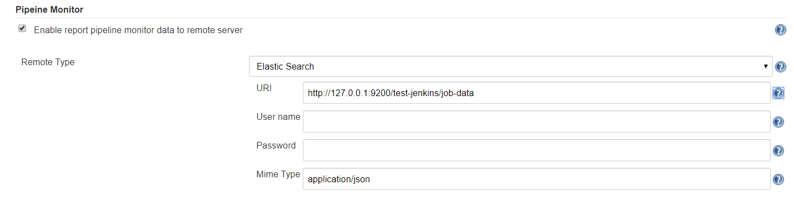

# Pipeline monitor plugin

<p align="center">
	
	<a href="https://travis-ci.org/slxiao/pipeline-monitor-plugin">
		
	</a>
    <a href="(https://opensource.org/licenses/MIT">
		
	</a>
</p>

`Pipeline monitor plugin` is an Jenkins [plugin](https://plugins.jenkins.io/) that is capable of automatically collecting pipeline build, stage, testing and coverage data and forward such key data to remote center (e.g., elasticsearch) for further exploitation.

# How to install
- Generate the `pipeline-monitor.hpi` file under `target` directory with command: `mvn clean package`
- Copy the generated `hpi` file to the directory `$JENKINS_HOME/plugins`
- Restart jenkins

# How to configure
`pipeline-monitor-plugin` is configured at Jenkins global configuration page (Jenkins home -> Manage Jenkins -> Configure System).

You can specify whether to enable this plugin, how to connect to Elasticsearch, and etc.



One example data is as below. It shows that the result of pipeline stage `checkout` of job `test-pipeline` is `CompletedSuccess` and the duration is `50ms`.
```json
{
  "_index": "test-jenkins",
  "_type": "job-data",
  "_id": "Ks9Dp24BMQms4qjvQk0n",
  "_source": {
    "PipelineStageStatus": {
      "jenkinsUrl": "http://127.0.0.1:49001/",
      "jobName": "test-pipeline",
      "number": 42,
      "name": "checkout",
      "startTime": 1574764231812,
      "result": "CompletedSuccess",
      "duration": 50
    },
    "@timestamp": "2019-11-26T10:30:31.815+0000"
  }
}
```

# Key features of the plugin
- [x] Post restful messages to Elasticsearch
- [x] Collect pipeline build result
- [x] Collect pipeline stage result
- [x] Collect semi-standard  xUnit test result
- [x] Collect semi-standard Cobertura test coverage result
- [ ] Collect diff coverage result (**Pending, may be a dedicated diff-coverage-plugin is preferred**)

# Lisense
MIT

# How to contribute

Fork the project on [Github](https://github.com/slxiao/pipeline-monitor-plugin), make your feature addition or bug fix, write tests, commit, and then send out pull request. 